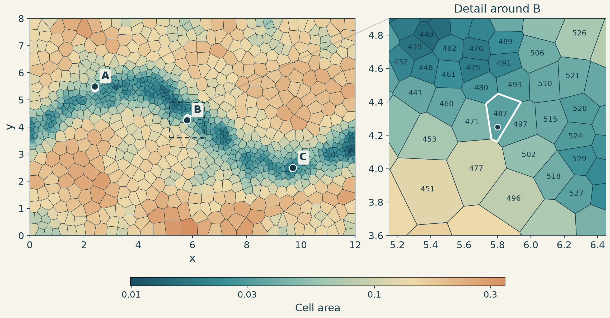

# Point lookups in 2D

Assigning measurements to grid cells lets us group rows by region. This
[grid](unstructured_grid/grid.geojson) has 1,000 polygons covering a `12 × 8`
rectangle, with smaller cells along a winding channel. The task is to find the
cell containing each point `(x, y)`.

The polygons form a Voronoi grid: each cell contains the locations closest to
one generating point. This extends the [nearest-entry lookup](1%20piecewise%20functions.md#1-find-the-nearest-entry)
from a single coordinate to a pair of coordinates.



We can represent the lookup as a decision tree. Each decision checks which
side of a line the point lies on, using `wx * x + wy * y >= threshold`, and
selects one of two branches. Following these branches leads to a cell ID.

With [the tree defined](unstructured_grid/grid.sql), the query is:

```sql
SELECT x, y, decision_tree(unstructured_grid_tree(), x, y) AS cell_id
FROM measurements;
```

Points outside the rectangle return `NULL`. The grid stays fixed, so the tree
can be built once and reused for many queries.

The [builder](unstructured_grid/point_location.py) considers lines halfway
between pairs of generating points. Each line separates locations closer to
one point from those closer to the other. It favors cuts that leave similar
numbers of possible cells on each side and cross few polygons.

A polygon crossed by a cut is split into two parts, which continue down separate
branches. Both parts keep the original cell ID. This is why a cell can appear
at several leaves even though the grid itself stays the same. The tree has
4,090 decision nodes and needs at most 18 comparisons per point, including
four checks against the rectangle's edges. Building it took about 2 seconds,
excluding grid generation, file writing, and plotting.

The same tree can be written as a [nested SQL `CASE` expression](unstructured_grid/grid_case.sql),
with one `CASE WHEN` for each decision. Another SQL solution stores one polygon
per row and joins measurements to the cells that cover them:

```sql
SELECT p.x, p.y, c.cell_id
FROM measurements AS p
LEFT JOIN grid_cells AS c
  ON ST_Covers(c.geom, ST_Point(p.x, p.y));
```

This [join](unstructured_grid/spatial_join.sql) uses DuckDB's
[spatial extension](https://duckdb.org/docs/current/core_extensions/spatial/functions#st_covers).
On a shared edge it can return both neighboring cells; the tree selects one.

All three approaches returned the same cell for every point in a comparison
over one million unsorted, uniformly distributed points:

| Approach | ns/row |
| --- | ---: |
| apart | 35.7 |
| Nested SQL `CASE` | 6,197 |
| Polygon join | 2,123 |

These are median query times in nanoseconds per row, including reading the
points and summing the returned cell IDs. Loading and query preparation are
excluded.

The [3D example](3%20unstructured%20grid%203D.md) uses the same idea with
polyhedral cells and cuts along planes.
