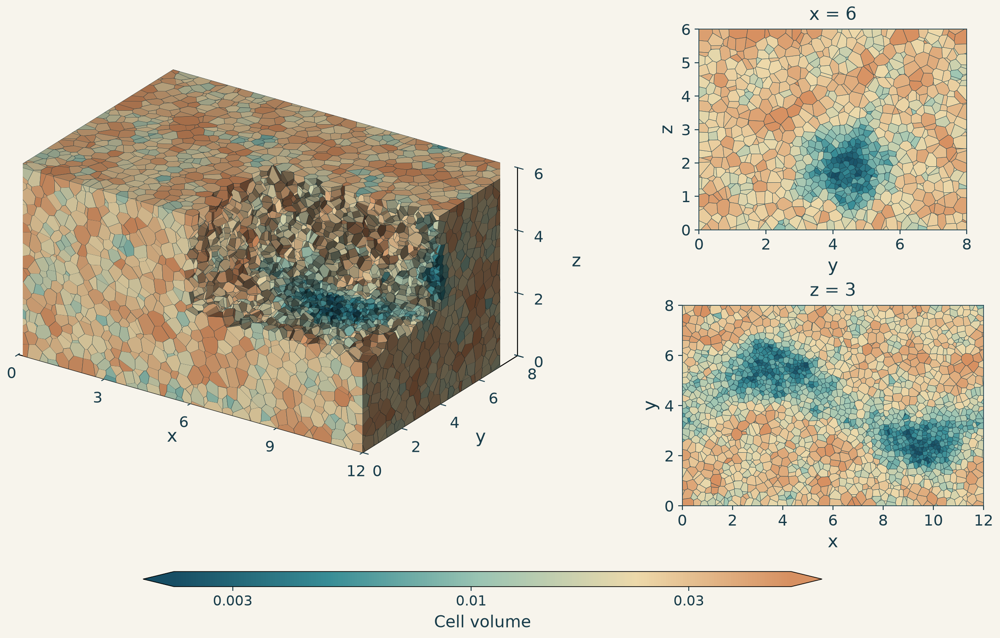

# Point lookups in 3D

The [2D lookup](2%20unstructured%20grid.md) extends to three coordinates:
assign each point `(x, y, z)` to the cell containing it. This
[grid](unstructured_grid_3d/grid.npz) has 30,000 polyhedral cells filling a
`12 × 8 × 6` box.

Each cell contains the locations closest to one generating point. Placing more
of these points around a winding tube makes the cells smaller there.



The cutaway removes cells from one corner to reveal the interior. The two
cross-sections show where the planes `x = 6` and `z = 3` pass through the grid.
Color indicates cell volume.

Each tree decision checks which side of a plane the point lies on, using
`wx * x + wy * y + wz * z >= threshold`. Following the selected branches leads
to a cell ID. With [the tree defined](unstructured_grid_3d/grid.sql.gz), the query is:

```sql
SELECT x, y, z,
       decision_tree(unstructured_grid_3d_tree(), x, y, z) AS cell_id
FROM measurements;
```

Points outside the box return `NULL`. As in 2D, the tree can be reused while
the grid stays fixed.

The [builder](unstructured_grid_3d/point_location.py) first tries cuts parallel
to the box faces, looking for similar numbers of possible cells on each side.
When these cuts cannot narrow down both branches, it considers planes halfway
between pairs of generating points. These separate locations closer to one
point from those closer to the other.

Cell vertices and bounding boxes help determine which cells can lie on each
side of a plane. A cell remains a candidate unless these bounds rule it out.
This keeps construction simple, but may leave extra branches that no point
reaches. For small groups of cells, the builder checks the possible cuts once
and reuses the results for the remaining decisions.

Planes can cut through cells, so the same cell ID may appear at several leaves.
The tree has about 1.57 million decision nodes and needs at most 32 comparisons
per point, including six checks against the box faces. Building it took about
40 seconds.

The median query time was 208.4 nanoseconds per row over 10 million unsorted,
uniformly distributed points.
